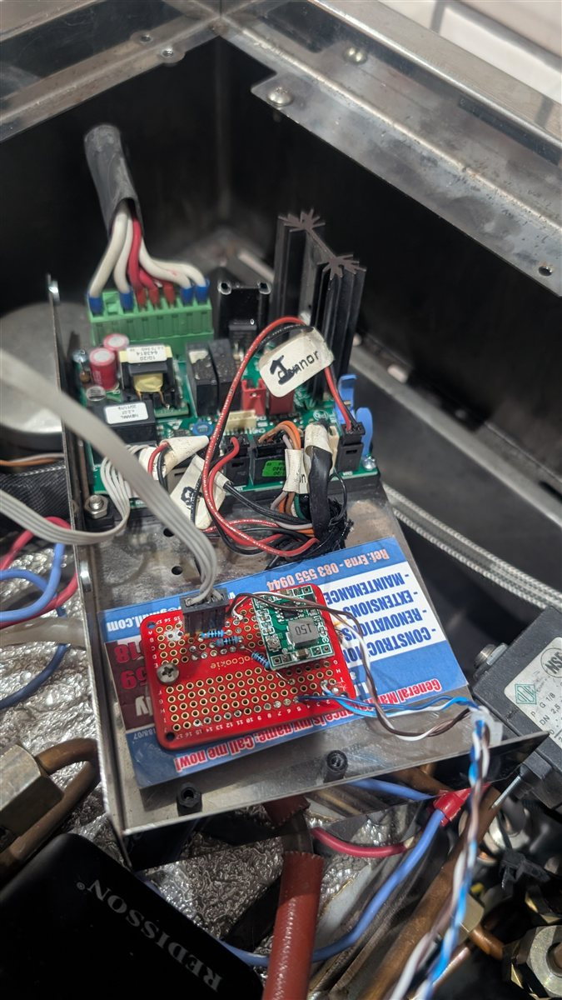

# Wiring

How to connect the FireBeetle 2 ESP32-S3 (DFR0975) to the DFR1092 display
and to the Linea Mini's CN11 connector. Pin assignments below are the single
source of truth in `platformio.ini` (`[env:lm_controller_s3]` build flags) —
if this document and the build flags ever disagree, the build flags win.

## 1. Display + touch (DFR1092)

The DFR1092 plugs straight into the DFR0975's **18-pin GDI FPC connector**
with the ribbon cable supplied with the display — no discrete wiring is
needed. Power, SPI (display), I²C (touch), backlight, and reset all run over
the one cable.

For reference (or if you are hand-wiring instead of using the GDI cable),
the GDI connector maps to these ESP32-S3 GPIOs:

| Signal | GPIO | Notes |
| --- | --- | --- |
| SPI SCLK | 17 | Display clock |
| SPI MOSI | 15 | Display data out |
| SPI MISO | 16 | Display data in |
| Display CS | 18 | Chip select |
| Display DC | 3 | Data/command |
| Display RST | 38 | Reset |
| Backlight | 21 | PWM-capable |
| Touch SCL | 2 | GT911 I²C clock |
| Touch SDA | 1 | GT911 I²C data |
| Touch INT | 13 | GT911 interrupt |
| Touch RST | 12 | GT911 reset |

**Do not reuse GDI pins for anything else.** GPIO 1/2/3/13 in particular
look temptingly free on the header but are carrying touch and display
signals — an earlier bring-up put the GICAR UART on GPIO13 and got checksum
errors plus a dead touchscreen from bus contention.

## 2. Machine interface (CN11)

CN11 is a 4-pin connector on the machine's GICAR main board (E.1.059). It
carries power and a serial link:

| Pin | Signal | Direction | Level |
| --- | --- | --- | --- |
| 1 | GND | — | 0 V |
| 2 | RXD | machine ← controller | 2.5 V LVCMOS |
| 3 | TXD | machine → controller | 2.5 V LVCMOS |
| 4 | +12 V | machine → controller | 12 V |

> CN11 is labelled "RS-232" on some documentation, but the signals are
> empirically 2.5 V LVCMOS, **idle-low** — no RS-232 level shifter is needed
> (and fitting one would damage the board). Because the lines idle low, the
> firmware opens the UART with `invert=true`; this is already handled in
> `gicar.cpp`.

### Interface circuit

The adapter board, mounted beside the GICAR controller (green board) with the
CN11 cable, buck converter, and the series/pull-up resistors:

<p align="center">
  
</p>

```
CN11                        Adapter board                    FireBeetle 2 ESP32-S3
────                        ─────────────                    ─────────────────────
Pin 4 (+12V) ─────────────► [buck converter, set to 3.3V] ─► 3V3 pin
Pin 1 (GND)  ─────────────────────────────────────────────── GND pin

                              R1 300Ω          R3 10kΩ
Machine TXD  ─────────────────┤├────────┬──────┤├───────── 3V3
                                        │
                                        └────────────────► GPIO14 (GICAR RX)

                              R2 300Ω
Machine RXD  ◄────────────────┤├────────────────────────── GPIO44 (GICAR TX)
```

Bill of materials:

| Ref | Value | Purpose |
| --- | --- | --- |
| U1 | Buck converter module (≥0.8 A) | 12 V → 3.3 V board power, fed to the FireBeetle's 3V3 pin. Trim to 3.3 V **before** connecting the ESP32. |
| R1 | 300 Ω ¼ W | Series protection, machine TXD → GPIO14 |
| R2 | 300 Ω ¼ W | Series protection, GPIO44 → machine RXD |
| R3 | 10 kΩ ¼ W | Pull-up, GPIO14 → 3.3 V (lifts the machine's 2.5 V idle level above the S3's ~2.47 V V<sub>IH</sub> threshold) |

The series resistors limit fault current to ~10 mA and add negligible
distortion at 9600 baud. The pull-up is only needed on the receive line;
GPIO44 already drives a full 3.3 V swing, which the machine accepts.

### ⚠️ The TXD/RXD labels at the plug are crossed

On the harness used to develop this project, the TXD/RXD labels at the CN11
plug were **swapped** relative to the actual signals (confirmed by loopback
test at the plug). This class of mistake has bitten this project twice, so:

1. Before wiring, run a **loopback test**: disconnect from the machine,
   bridge the two signal wires at the machine end of your harness, and
   verify the ESP32 receives back exactly what it sends.
2. After connecting to the machine, trust **decoded frames, not labels**. If
   the wiring is right, the serial log shows clean GICAR R-frames within a
   couple of seconds of the machine powering on. If you see nothing or
   garbage, swap the two signal wires (or swap `GICAR_RX_PIN`/`GICAR_TX_PIN`
   in `platformio.ini`) and try again — no harm is done either way thanks to
   the series resistors.

### Pin choice notes (ESP32-S3 / DFR0975)

- **GPIO14 (RX) / GPIO44 (TX)** are the verified-working pair.
- **Avoid GPIO43** on the DFR0975 — it only reached 0.75 V under drive
  during bring-up (cause unknown).
- **Avoid all GDI pins** (see section 1).
- The UART runs at **9600 8N1, inverted**, with an enlarged 2 KB RX buffer —
  all configured in firmware; nothing to set up in hardware.

## 3. Power

The controller is powered from CN11 pin 4 (+12 V) through the buck
converter, set to **3.3 V** and fed straight into the FireBeetle's 3V3 pin
(bypassing the board's own regulator). Budget ≥500 mA (ESP32-S3 with WiFi
active plus the display backlight). Set-up procedure for the buck module:

1. Power it from a bench supply at 12 V with no load.
2. Trim the output to 3.3 V.
3. Connect the ESP32, boot it with WiFi up, and re-measure — re-trim if the
   output sags below ~3.1 V (the ESP32-S3's minimum is 3.0 V).

> Because the 3V3 pin is fed directly, avoid plugging in USB while the
> machine is powering the board — the buck output and the FireBeetle's
> onboard USB regulator would be driving the same rail. Power from one
> source at a time.

Route the cable away from the mains wiring and heating elements inside the
machine.

## 4. Verification checklist

- [ ] Buck output 3.3 V unloaded, ≥3.1 V with the controller booted and WiFi up
- [ ] Loopback test at the CN11 plug passes byte-perfect
- [ ] Controller boots, display renders, touch responds
- [ ] GICAR frames decode within seconds of machine power-on (live boiler
      temperature on the main screen confirms RX)
- [ ] A write command (e.g. changing target temperature from the settings
      menu) takes effect on the machine (confirms TX)
- [ ] No component warm to the touch after 30 minutes of operation
