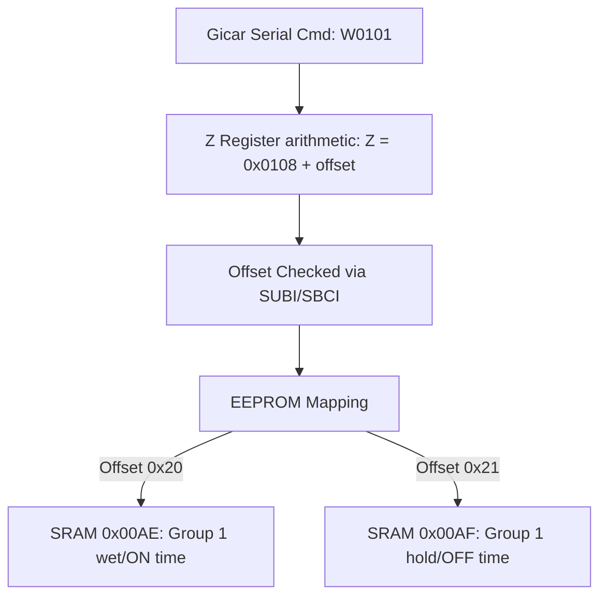

# Gicar Controller Protocol & Register Deep-Dive Analysis
**Linea Mini IoT Gateway & Gicar Controller Reverse Engineering**

This document details the findings from a comprehensive reverse engineering analysis of the Linea Mini IoT firmware binaries:
- [lm_gateway_backup.bin](file:///C:/Users/johnb/Documents/antigravity/LaMarzocco_Mini/firmware/lm_gateway_backup.bin) (4MB ESP32 Gateway firmware)
- [lm_storage.bin](file:///C:/Users/johnb/Documents/antigravity/LaMarzocco_Mini/firmware/lm_storage.bin) (4MB LittleFS image containing storage files)
- [machine.bin](file:///C:/Users/johnb/Documents/antigravity/LaMarzocco_Mini/firmware/storage/machine.bin) (28KB AVR ATmega32 microcontroller binary extracted from storage)

These findings compare the existing [GICAR_REGISTER_MAP.md](file:///C:/Users/johnb/Documents/antigravity/LaMarzocco_Mini/GICAR_REGISTER_MAP.md) with our static analysis of the gateway code and the microcontroller assembly.

---

## 1. Overview of the Firmware Stack

Our analysis of the binaries shows that the IoT system consists of two main processing units:
1. **The IoT Gateway (ESP32)**: Running the application stack compiled in `lm_gateway_backup.bin`. It communicates with the cloud (MQTT/HTTPS) and Bluetooth scales (Acaia Lunar), and acts as the serial master for the Gicar board.
2. **The Gicar Controller (ATmega32)**: Running the low-level machine safety, boiler control, and logic loops. It acts as a serial slave, responding to commands sent by the gateway. The firmware is stored in the Gateway's LittleFS filesystem (`lm_storage.bin`) as `machine.bin` so that the gateway can flash it during OTA updates.

---

## 2. Newly Discovered Gicar Command Protocols

The standard Gicar protocol uses `'R'` (Read) and `'W'` (Write) commands. However, disassembly of the microcontroller's UART receiver packet parser (`machine.bin` offset `0x27CA`) reveals three **new command characters** that were previously undocumented:

| Command Char | ASCII (Hex) | Purpose / Description | Expected Response |
|:---:|:---:|---|---|
| **`H`** | `0x48` | **Serial Handshake / Echo Check**: Verifies serial connection and latency. | `Z[N]OK[CS]` |
| **`X`** | `0x58` | **Model Info & Version Query**: Requests firmware identifier strings. | `Z[N]X00000001[CS]` |
| **`S`** | `0x53` | **Status / Sensor Test Toggle**: Triggers internal self-tests (sets SRAM `0x0064` to `0x0A`). | Depends on sensor state |

### Handshake Protocol Example:
- **Gateway Sends**: `H50` (where `50` is the checksum of `'H'`)
- **Gicar Responds**: `Z0OK4B` (where `4B` is the checksum of `'O'` + `'K'`)

---

## 3. Newly Discovered Gicar Registers

By tracing the register mapping functions in the gateway's [GicarCmdService](file:///C:/Users/johnb/Documents/antigravity/LaMarzocco_Mini/firmware/disasm_full.txt) and the AVR address resolver `0x23D8` in `machine.bin`, we identified a set of missing registers.

### A. Factory Test Mode Relays (`0x8000` - `0x8007`)
In `GICAR_REGISTER_MAP.md`, these were speculatively marked as "Advanced group/boiler control". Disassembly of the gateway's `GicarCmdService` reveals that these are **Factory Test Mode Relays** used for diagnostics. 

> [!WARNING]
> These registers only accept write commands if the Gicar controller is put into **Test Mode** first (otherwise, the controller responds with `"Machine Not in test mode"`).

| Address | R/W | Length (Bytes) | Command Example | Target Telemetry / Relay Activated |
|:---:|:---:|:---:|---|---|
| **`0x8000`** | W | 1 | `W8000000101` | Pump Relay & Pre-Infusion (`TEST PRE_INF`) |
| **`0x8002`** | W | 1 | `W8002000101` | Coffee Boiler Heating Element Relay (`TEST R_CAFF`) |
| **`0x8003`** | W | 1 | `W8003000101` | Steam Boiler Heating Element Relay (`TEST R_VAPO`) |
| **`0x8004`** | W | 1 | `W8004000101` | Coffee Solenoid 3-Way Valve (`TEST EV_CAFF`) |
| **`0x8005`** | W | 1 | `W8005000101` | Water Refill Solenoid Valve (`TEST EV_CARICO`) |
| **`0x8007`** | W | 1 | `W8007000101` | Display LEDs Test (`DISPLAY_TEST` / `TEST LED`) |

### B. Steam Boiler Offset Register (`0x00FD`)
- **Address**: `0x00FD` (R/W, 1 byte)
- **Function**: Writes a 1-byte temperature offset value (`steam_offset`) to calibrate the steam boiler temp readout.
- **Gateway string**: `[0;32mI (%s) %s: Stean Offset : %d` (with a typo `"Stean"` in ESP32 logs).

### C. Telemetry Data Register (`0x401C`)
- **Address**: `0x401C` (R, 4 bytes)
- **Function**: Polled by the gateway during active operations. Maps to scale weight status, flow telemetry, or error logging buffers.

### D. Block Read Commands for Pre-Infusion Settings
The Gicar controller groups pre-infusion timings in large blocks to reduce serial transmission overhead. The gateway uses the following block reads instead of single register lookups:

| Address | R/W | Length (Bytes) | Memory Buffer Layout |
|:---:|:---:|:---:|---|
| **`0x0101`** | R/W | 16 (`0x0010`) | **Group 1 pre-infusion wet/ON times** (5 buttons + padding). |
| **`0x0111`** | R/W | 37 (`0x0025`) | **Group 1 pre-infusion hold/OFF times** (5 buttons + padding). |
| **`0x0136`** | R/W | 26 (`0x001A`) | Group 2 pre-infusion wet/ON times (unused on single-group Mini). |
| **`0x0150`** | R/W | 37 (`0x0025`) | Group 2 pre-infusion hold/OFF times (unused on single-group Mini). |
| **`0x0100`** | R/W | 1 (`0x0001`)  | Pre-infusion Mode configuration state. |

---

## 4. Complete Gicar Register Map Comparison

The table below maps all registers identified across the ESP32 Gateway and the AVR Controller, highlighting what was previously missing:

| Register Address | Operation | Size (Bytes) | Status in `GICAR_REGISTER_MAP.md` | Actual Purpose / Context |
|---|:---:|:---:|---|---|
| **`0x0000`** | R/W | 1 | Partially Documented | Machine identity and status flags |
| **`0x0002`** | W | 1 | **Missing** | Refill / configuration write command |
| **`0x0006`** | R | 1 | Documented | Machine configuration byte |
| **`0x0007`** | W | 2 | Documented | Coffee boiler temperature setpoint (High Byte) |
| **`0x0008`** | W | 1 | **Missing** | Coffee boiler temperature setpoint (Low Byte) |
| **`0x0009`** | W | 2 | Documented | Steam/Secondary boiler temperature setpoint |
| **`0x0020`** | R | 44 | Documented | EEPROM / Configuration parameter block dump |
| **`0x0050`** | R | 24 | Documented | Real-time sensor and telemetry status block |
| **`0x0058`** | W | 1 | Documented | Machine soft-reboot trigger |
| **`0x0059`** | W | 2 | Documented | Purpose unknown |
| **`0x00E1`** | W | 1 | Documented | Operating mode register (Refill, Steam, Cleaning) |
| **`0x00E2`** | R | 1 | Documented | Post-mode command initialization read |
| **`0x00FD`** | W | 1 | **Missing** | Steam boiler temperature calibration offset (`steam_offset`) |
| **`0x0100`** | R/W | 1 | **Missing** | Pre-infusion status flag |
| **`0x0101`** | R/W | 16 | **Missing (polled)** | Group 1 pre-infusion wet/ON block |
| **`0x0111`** | R/W | 37 | **Missing (polled)** | Group 1 pre-infusion hold/OFF block |
| **`0x0136`** | R/W | 26 | **Missing (polled)** | Group 2 pre-infusion wet/ON block |
| **`0x0150`** | R/W | 37 | **Missing (polled)** | Group 2 pre-infusion hold/OFF block |
| **`0x0300`** | R/W | 7 | Documented | Mode configuration block |
| **`0x0310`** | R/W | 29 | Documented (Write missing) | Calibration and diagnostics buffer |
| **`0x0400`** | W | 3 or 7 | **Missing** | Firmware flash utility controller interface |
| **`0x0406`** | W | 1 | Documented | Machine Standby Mode trigger |
| **`0x0410`** | R/W | 29 | Documented (Write missing) | Calibrations block |
| **`0x4000`** | R | 35 | Documented | Machine state poll (Z6 temperature stream) |
| **`0x4001`** | R | 1 | Documented | Coffee boiler heating state |
| **`0x4002`** | R | 1 | Documented | Steam boiler heating state |
| **`0x4003`** | R | 12 | Documented | Shot timer and telemetry values |
| **`0x4010`** | R | 1 | Documented | Real-time water refill probe status |
| **`0x401C`** | R | 4 | **Missing** | Telemetry logs (shot diagnostics, weight status) |
| **`0x8000`** | W | 1 | Documented (Incorrect) | Test mode: Pump & Pre-infusion relay |
| **`0x8002`** | W | 1 | Documented (Incorrect) | Test mode: Coffee boiler relay |
| **`0x8003`** | W | 1 | Documented (Incorrect) | Test mode: Steam boiler relay |
| **`0x8004`** | W | 1 | Documented (Incorrect) | Test mode: Coffee solenoid valve |
| **`0x8005`** | W | 1 | Documented (Incorrect) | Test mode: Refill solenoid valve |
| **`0x8007`** | W | 1 | Documented (Incorrect) | Test mode: Display/LED test |

---

## 5. Handshake & Bootloader Flashing Protocols

Deep analysis of the gateway firmware binary (`lm_gateway_backup.bin`) and Gicar microcontroller firmware (`machine.bin`) reveals a dual-mode communication handshake scheme. The gateway interfaces with the Gicar board in two separate states: **Application Mode** (normal operation) and **Bootloader Mode** (firmware updates).

### A. Application Mode Handshake (Probe Connection)
To establish and verify a connection on boot or reboot, the gateway queries the machine's running state using the **Application Probe** command:

- **Probe Request (Gateway -> Gicar)**: `X00000000D8`
  - Command: `'X'` (`0x58`)
  - Address/Length bytes: `00000000`
  - Checksum: `D8` (computed as `(0x58 + 0x30 * 8) % 256 = 0xD8`)
- **Probe Response (Gicar -> Gateway)**: `Z[seq]X00000001[2-byte status][CS]` (15 bytes total)
  - Prefix: `Z[seq]`
  - Command: `'X'`
  - Status Payload: `00000001` (indicates running in application mode)
  - Telemetry Data: 2 bytes of sensor data
  - Checksum: 2 ASCII hex characters

Once the gateway parses a valid 15-byte `ZX00000001` frame, it transitions the machine state to `connected = true` and starts regular telemetry register polling (`R40000023` every 100ms).

### B. Bootloader Mode & Flashing Handshakes
During firmware recovery or OTA updates, the gateway forces the Gicar board to reboot into its internal bootloader using the following sequence:

1. **Enter Bootloader Command**: The gateway sends `X00000002DA` (checksum `DA`).
2. **Bootloader Sync Frame**: Upon rebooting into the bootloader, the Gicar board continuously broadcasts the sync packet `HRYF3` over serial (`'H' + 'R' + 'Y' = 0x48 + 0x52 + 0x59 = 0xF3` checksum).
3. **Bootloader Handshake**: The gateway responds to the sync frame with a bootloader handshake `H00000000C8`. The Gicar board acknowledges with `HOKE2` (`'H' + 'O' + 'K' = 0xE2` checksum).
4. **Firmware Header Transmission**: The gateway initiates the transfer by sending `H0000` + `[4-digit hex firmware size]` + checksum.
5. **Firmware Chunk Acknowledgment**: The gateway writes binary chunks, and after each chunk, the Gicar board responds with `#OKBD` (`'#' + 'O' + 'K' = 0xBD` checksum).
6. **Exit Bootloader Command**: Once transmission completes, the gateway reboots the Gicar board back to application mode by sending `X00000001D9` (checksum `D9`).

---

## 6. Microcontroller Memory Map Analysis

In `machine.bin`, the Gicar address lookup is optimized by matching offset blocks. The registers `0x00AE` through `0x00C9` are placed in a continuous sequence inside SRAM (starting at `0x00AE`) and directly mirror EEPROM locations `0x00` through `0x1B` (word-aligned):

When a write occurs to these settings, the microcontroller:
1. Receives the data byte in the UART RX loop.
2. Writes it to the corresponding SRAM address in the `0x00AE - 0x00C9` block.
3. Invokes the EEPROM writer function [0x1908](file:///C:/Users/johnb/Documents/antigravity/LaMarzocco_Mini/firmware/disasm_full.txt#L3223) passing the EEPROM offset, ensuring configurations persist across power cycles.
